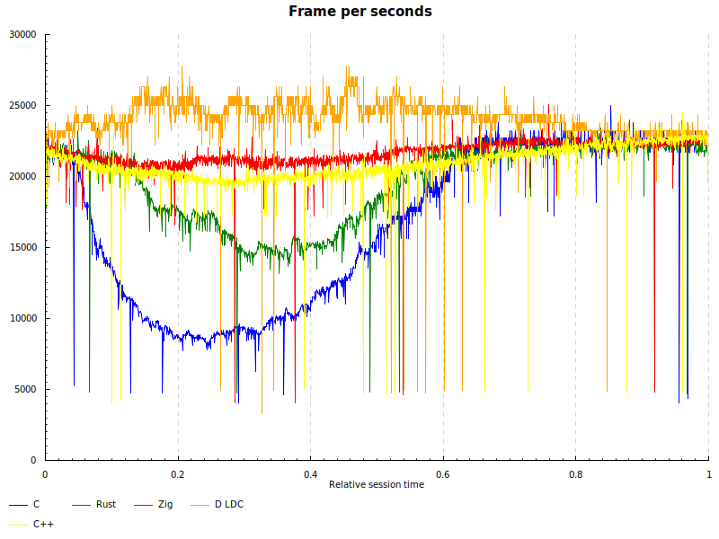
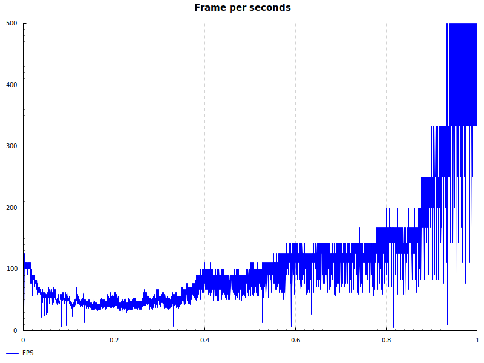
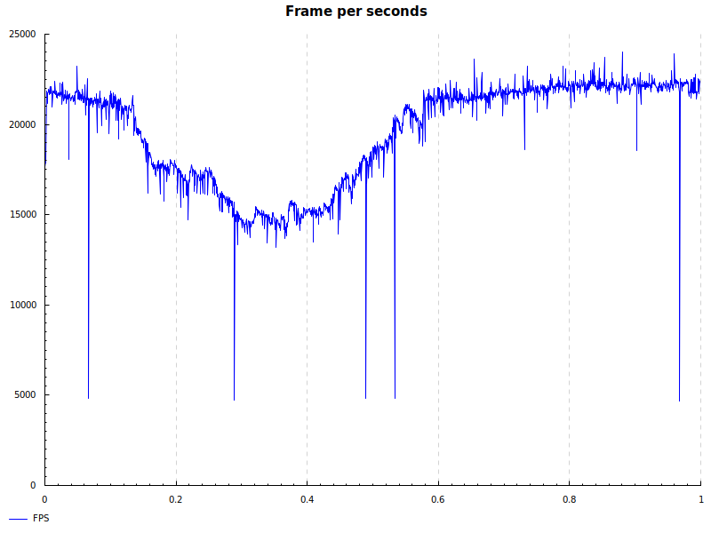
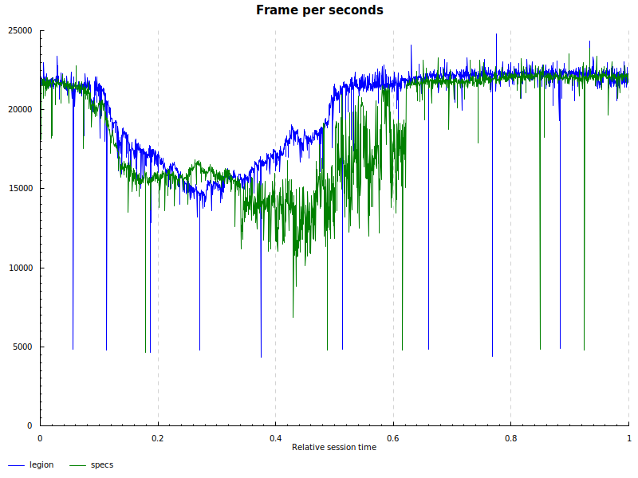
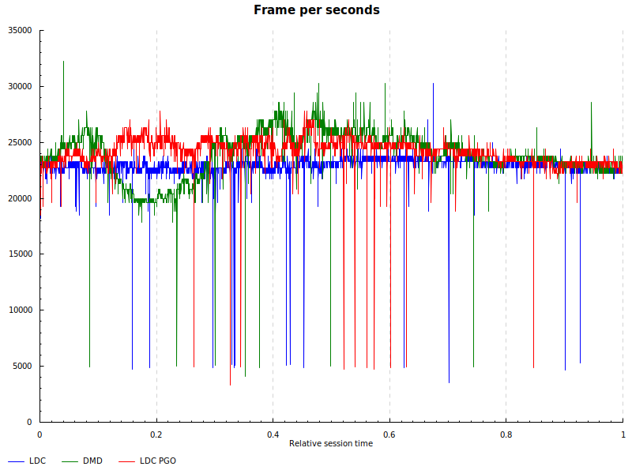
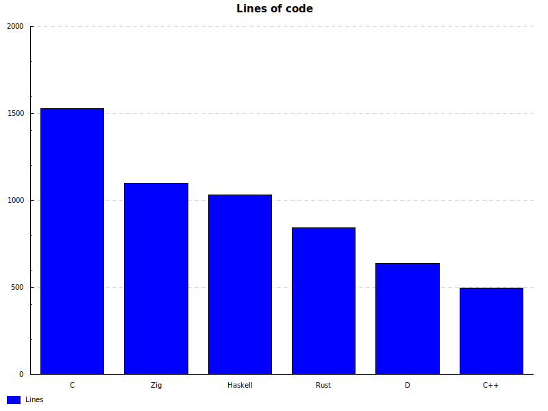
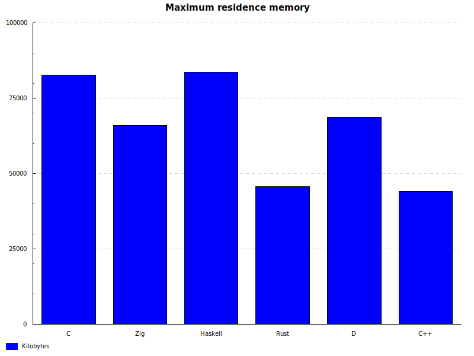

# asteroids-arena

The repo contains demo implementations of simple game in several languages to test their average performance, expressive power and my subjective
joy of their usage.

# Game concept

The game is 2D. The world is wrapped around edges. You are a triangular space ship with single engine without breaks. The ship has single gun that fires bullets.
The world is filled with circular asteroids that doesn't collide with each other and collide with you. On collision with the asteroid
you die. Asteroid breaks into two smaller ones on collision with bullet, but if asteroid is smaller a threshold it is destroyed. Bullets
don't collide with the ship. Asteroids are randomly distributed across world on start. You win if you kill all asteroids, you loose when
you die.

Important gameplay feature that bullets has relative speed to the ship when spawned, so if you shoot backward, you can get bullet that doesn't move relative to
the world. There should be three supported sound effects. First, thrust sound when ship accelerates. Second, fire sound. Finally, bangs on asteroid destruction and player death. For simplicity player respawns in center of world on death.

# Implementation restrictions

* Implement entity-component-system design. If language design is not suited well for the pattern, it is acceptable to choose another design.
* Asteroids have [circloid shape](./c/asteroids/src/render.c#L35) and you should not memorize asteroid lines. That restriction allows to see how language backend
deals with heavy load of 2D rendering (trigonometry e.x.). But you can batch all rendering calls.
* Measure FPS of full frame with world step and rendering.
* Use SDL for rendering.
* Concurrency is allowed.

# Languages

I am personally interested to compare some not common languages for gamedev.

Languages:
- Haskell. My major language. The goal to test pressure of GC on performance and if it really more comfortable for game developing. **Done**.
- C. Control group for performance. **Done**.
- ATS2. Low level FP language with dependent typing that will allow mutation in place, redundant checks elimination and zero cost abstractions. **On hold**.
- D. Curious to test it with GC and without GC. **Done**.
- Zig. Low level alternative to pure C. Curious in performance and if it easy to bind to C libraries. **Done**.
- Rust. Curious in performance and expressive power comparing to Haskell. **Done**.

# Results


## FPS

FPS plots are built with [haskell utility](./haskell/plotting). Like:
```
cabal new-run plotting -- single fps.out
# or
cabak new-run plotting -- multiple Haskell ./fps_haskell.out Rust ./fps_rust.out Zig ./fps_zig.out
```
In haskell nix-shell.



### Haskell
FPS now stable 40-100, smooth gameplay, but there are noticeable freezes at, possibly, major GCs.


### C
There is smooth gameplay. Some drops can be explained by interference of other software in OS.


### Rust
Smooth gameplay. It was quite easy to implement the game and get high performance from first try.



I used specs as first implementation and than rewrote to legion for more cleaner code. Amount of code
and memory usage is dropped significantly. Also, I disabled legion multithreading as performance
with it drops to maximum 6000 FPS as the major time game sit in work stealer inside legion schedule system.
In single thread mode both ECS have near identical performance.



### Zig
Very stable frame rate. Feels like great upgrade over C in development experience and performance.


### D
There are two different compilers. First, DMD is original implementation of language. Second, LDC is
LLVM based implementation. DMD is usually slower than LDC, but in the particular case it's not. I have
no idea why DMD generates code that is FASTER for rendering dozens of asteroids than rendering empty screen.
LDC behaves like other LLVM based languages (stable constant FPS), but FPS slightly higher than the closest competitor (Zig).
I implemented custom ECS in the implementation and it feels like the closest to the "production" state.

Also I used LLVM PGO (Profiling Guided Optimizations) for LDC, that makes DMD and LDC results near identical.



## Line of Code

```
-------------------------------------------------------------------------------
Language                     files          blank        comment           code
-------------------------------------------------------------------------------
C                               19            163              3           1159
Zig                             23            165            149           1097
Haskell                         25            157             37           1033
D                               32            194            184           1015
Rust                            23            113             74            842
```



## Memory

Measured with `command time -v <exe>`:

| Language | Max memory Kb |
|----------|---------------|
| C        | 82760         |
| Zig      | 65984         |
| Haskell  | 83628         |
| Rust     | 45616         |
| D        | 68688         |



## My machine

It is important that all measurements of performance are done in equal environment. So, FPS benchmarks are executed on my personal PC that has:
* RTX 2080 Ti
* AMD Ryzen 9 3950X
* NixOS x86_64  
* SSD
* 64 GiB RAM
