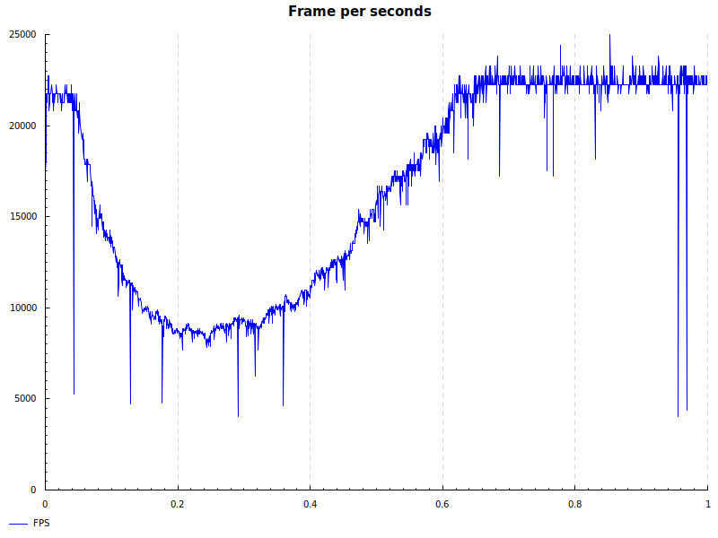
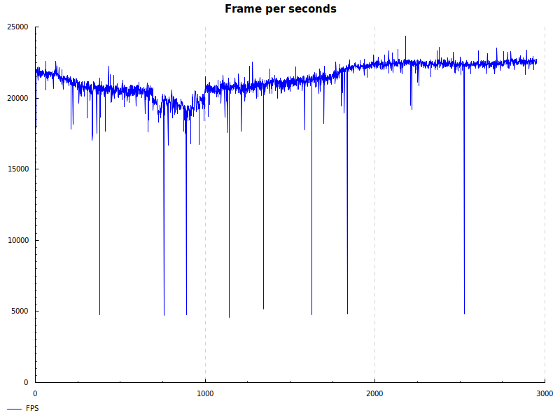

# asteroids-arena

The repo contains demo implementations of simple game in several languages to test their average performance, expressive power and my subjective
joy of their usage.

# Game concept

The game is 2D. The world is wrapped around edges. You are a triangular space ship with single engine without breaks. The ship has single gun that fires bullets.
The world is filled with circular asteroids that doesn't collide with each other and collide with you. On collision with the asteroid
you die. Asteroid breaks into two smaller ones on collision with bullet, but if asteroid is smaller a threshold it is destroyed. Bullets
don't collide with the ship. Asteroids are randomly distributed across world on start. You win if you kill all asteroids, you loose when
you die.

# Implementation restrictions

* Implement entity-component-system design.
* Separate world simulation from rendering to benchmark TPS between languages.
* Use SDL for rendering.

# Languages

I am personally interested to compare some not common languages for gamedev.

Languages:
- Haskell. My major language. The goal to test pressure of GC on performance and if it really more comfortable for game developing. **Done**.
- C. Control group for performance. **Done**.
- ATS2. Low level FP language with dependent typing that will allow mutation in place, redundant checks elimination and zero cost abstractions. **On hold**.
- D. Curious to test it with GC and without GC. Not started yet.
- Zig. Low level alternative to pure C. Curious in performance and if it easy to bind to C libraries. **Done**.
- Rust. Curious in performance and expressive power comparing to Haskell. **Done**.

# Results


## FPS

FPS plots are built with [haskell utility](./haskell/plotting). Like:
```
cabal new-run plotting -- single fps.out
# or
cabak new-run plotting -- multiple Haskell ./fps_haskell.out Rust ./fps_rust.out Zig ./fps_zig.out
```
In haskell nix-shell.


### Haskell
FPS now stable 40-100, smooth gameplay, but there are noticable freezes at, possibly, major GCs.


### C
There is smooth gameplay. Some drops can be explained by interference of other software in OS.


### Rust
Smooth gameplay. It was quite easy to implement the game and get high performance from first try.


### Zig
The most stable frame rate. Feels like insane upgrade over C in development experience and performance.


### My machine

It is important that all measurements of performance are done in equal environment. So, FPS benchmarks are executed on my personal PC that has:
* RTX 2080 Ti
* AMD Ryzen 9 3950X
* NixOS x86_64  
* SSD
* 64 GiB RAM
