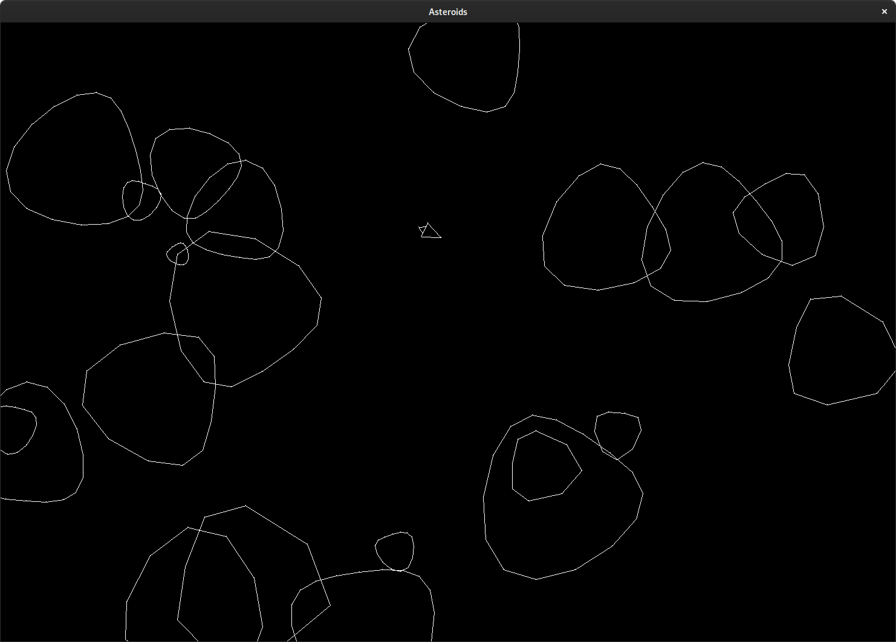

# asteroids-arena

The repo contains demo implementations of simple game in several languages to test their average performance, expressive power and my subjective
joy of their usage.

# Game concept

The game is 2D. The world is wrapped around edges. You are a triangular space ship with single engine without breaks. The ship has single gun that fires bullets.
The world is filled with circular asteroids that doesn't collide with each other and collide with you. On collision with the asteroid
you die. Asteroid breaks into two smaller ones on collision with bullet, but if asteroid is smaller a threshold it is destroyed. Bullets
don't collide with the ship. Asteroids are randomly distributed across world on start. You win if you kill all asteroids, you loose when
you die.

# Implementation restrictions

* Implement entity-component-system design.
* Separate world simulation from rendering to benchmark TPS between languages.
* Use SDL for rendering.

# Languages

I am personally interested to compare some not common languages for gamedev.

Languages:
- Haskell. My major language. The goal to test pressure of GC on performance and if it really more comfortable for game developing.
- C. Control group for performance.
- D. Curious to test it with GC and without GC.
- Zig. Low level alternative to pure C. Curious in performance and if it easy to bind to C libraries.
- Rust. Curious in performance and expressive power comparing to Haskell.

# Results



## FPS

FPS plots are built with [haskell utility](./haskell/plotting). Like:
```
cabal new-run plotting -- fps.out
```
In haskell nix-shell.

### Haskell
FPS drops to unplayable values very often.


### C
There is smooth gameplay. I experienced drops to 500 FPS occasionally.

